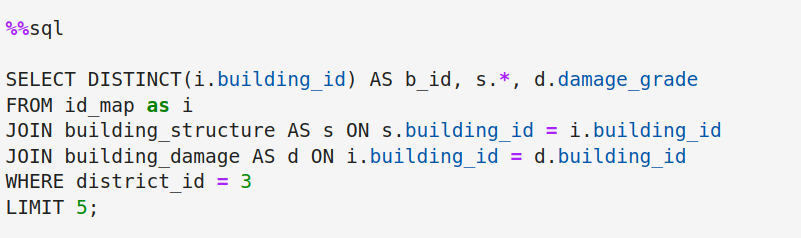

# Prediction of earthquake damage in Kavripalanchuk 🇳🇵

## Overview

Welcome 👋!, In this project, we will analyze and assess the damage caused by earthquakes in Kavrepalanchok, Nepal. Using data collected from [Open Data Nepal](https://opendatanepal.com/), this project employs data analysis and visualization techniques to understand the patterns and impacts of earthquake damage to improve future disaster preparedness and response.

## Project Overview

- **Get data by querying a sqlite database** 📊🔍

- **build a logistic regression model for classification** 🔨📈

- **build a decision tree model for classification** 🌳📈

- **ethical considerations into our model building** 🤝🧠

## Key Insights

- **SQL Query district 3 building**
  

- **[Sub data of district 3](images/02-sub-data.png)**
  

- **Distribution classes of severe damage column**
  

- **Relationship footprint feature and severe damage**
  

- **Logistic Regression model with encoder for categorical features**
  

- **Training and Validation to retrieve the max depth which is 10**
  

- **Decision Tree model based on the last max depth of the logisticregression model**
  

  - **Decision-Tree model content**
  

  - **Decision Tree plot**
  

  - **Importance of features**
  

## Resources

- **[Click here to access to the Open Data Nepal](https://opendatanepal.com/)**
- **[Click here to access to the code source of my Project](https://github.com/Younes202/Predict-Earthquake-Damage-in-Kavrepalanchok)**

## Contact

#### Feel free to reach out me on linkedin <a href="https://www.linkedin.com/in/younes-sghyer-08144119b/"> Younes Sghyer </a> if you have any questions or suggestions for improvement or collaboration. Thank you for visiting my repository!
