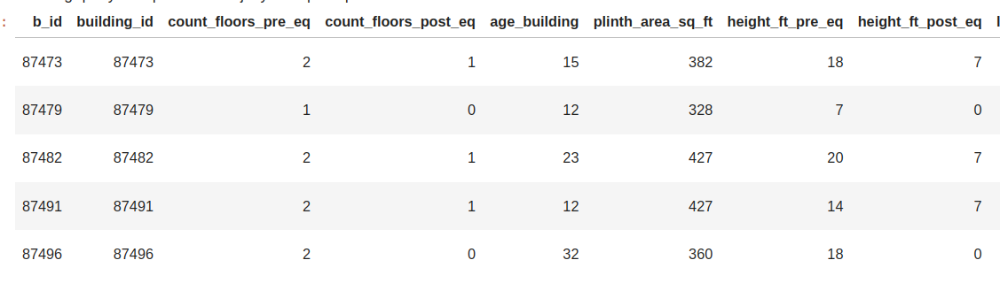
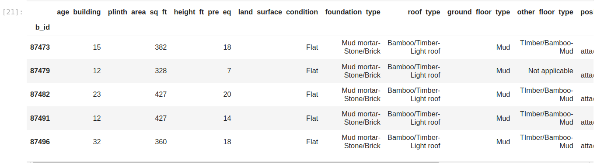
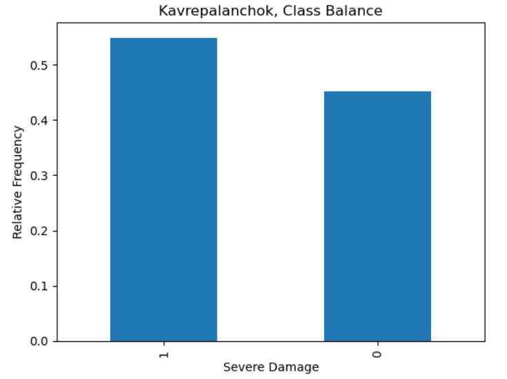
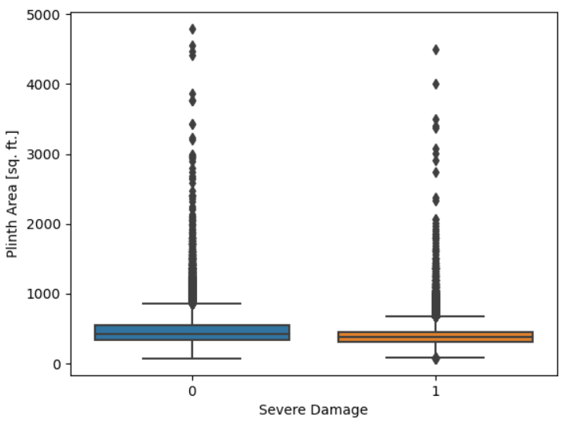
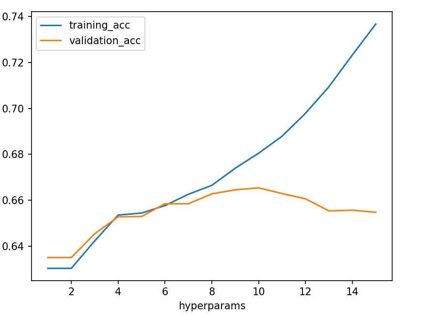
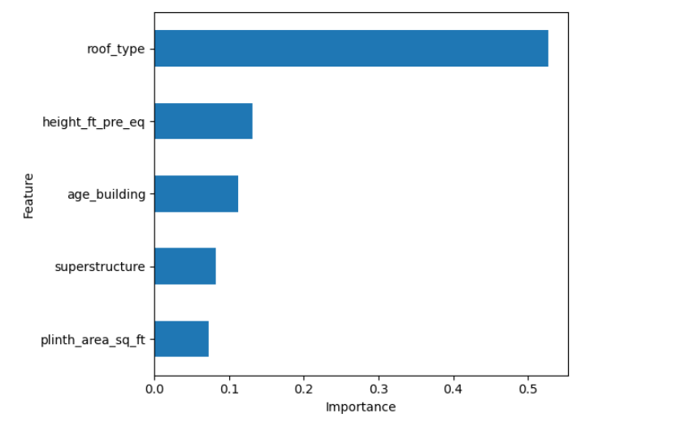

## Predict Earthquake Damage in Kavrepalanchok, Nepal 🇳🇵

## Welcome 👋

Salam 👋!, In this project, we will analyze and assess the damage caused by earthquakes in Kavrepalanchok, Nepal. Using data collected from Open  [Data Nepal](https://opendatanepal.com/), this project employs data analysis and visualization techniques to understand the patterns and impacts of earthquake damage to improve future disaster preparedness and response.


```python
# Import libraries here
import matplotlib.pyplot as plt
import pandas as pd
import sqlite3
import numpy as np
import seaborn as sns
from sklearn.model_selection import train_test_split
from sklearn.pipeline import Pipeline, make_pipeline
from sklearn.linear_model import LogisticRegression
from category_encoders import OneHotEncoder
from sklearn.metrics import accuracy_score
from sklearn.tree import DecisionTreeClassifier, plot_tree
from sklearn.preprocessing import OrdinalEncoder

```

## Prepare data

### Connect


```python
# Connect to the server and to the database nepal.sqlite
%load_ext sql
%sql sqlite:////home/jovyan/nepal.sqlite
```


```python
# As we have a large data on the table id_map we will select district building 
%%sql

SELECT DISTINCT district_id
from id_map;
```
Output:

district_id
1
2
3
4

```python
# The number of observatins in the table of id_map associetd in district 1
SELECT count(*)
from id_map where district_id=1;
```
Output:

count(*)
36112

```python
# The number of observatins in the table of id_map associetd in district 3

%%sql

SELECT count(*)
from id_map where district_id=3;
```
Output:

count(*)
82684

```python
# join the id_map, building_structure, and building_damage tables where district_id_id=3 and set building_id as b_id.
%%sql

SELECT DISTINCT(i.building_id) AS b_id, s.*, d.damage_grade
FROM id_map as i
JOIN building_structure AS s ON s.building_id = i.building_id
JOIN building_damage AS d ON i.building_id = d.building_id
WHERE district_id = 3
LIMIT 5;
```

Output: 



### Import and wrangling


```python
# Build your `wrangle` function here
def wrangle(db_path):
    
    # Connect to database
    conn = sqlite3.connect(db_path)
    
    ## Prepare the query we will work on
    query= """ SELECT DISTINCT(i.building_id) AS b_id, s.*, d.damage_grade
            FROM id_map as i
            JOIN building_structure AS s ON s.building_id = i.building_id
            JOIN building_damage AS d ON i.building_id = d.building_id
            WHERE district_id = 3 
        """ 
    # initialize a dataframe
    df = pd.read_sql(query, conn, index_col="b_id")
    
    # Drop List 
    drop_list=["count_floors_post_eq", "height_ft_post_eq", "condition_post_eq"]
    
    # Add 'severe_damage' column: 1 if last character of 'damage_grade' > 3, else 0.
    df["severe_damage"] = np.where(df["damage_grade"].str[-1].astype(int) >3, 1, 0)
    
    # Drop leaky columns 
    drop_list=["count_floors_post_eq", "height_ft_post_eq", "condition_post_eq"]
    
    # Drop redundant columns 
    drop_list.append("building_id")
    
    # Drop oldest target damage_grade
    drop_list.append("damage_grade")
    
    # Drop 
    drop_list.append("count_floors_pre_eq")
    # Drop columns    
    df.drop(columns=drop_list, inplace=True)

    
    return df
```


```python
df = wrangle("/home/jovyan/nepal.sqlite")
df.head()
```

Output: 



### Explore 


```python
# Create a bar chart with the normalized value counts from the "severe_damage" column. 
df["severe_damage"].value_counts(normalize=True).plot(
    kind="bar", xlabel="Severe Damage", ylabel="Relative Frequency", title="Kavrepalanchok, Class Balance"
)
```

Output: 




```python
# create a boxplot that shows the distributions of the "plinth_area_sq_ft" column for both groups in the "severe_damage" column.
sns.boxplot(x="severe_damage", y="plinth_area_sq_ft", data=df)
plt.xlabel("Severe Damage")
plt.ylabel("Plinth Area [sq. ft.]")
```

Output:




```python
# Create a pivot table of df where the index is "roof_type" and the values come from the "severe_damage" column, aggregated by the mean.
roof_pivot = pd.pivot_table(df, index='roof_type', values='severe_damage', aggfunc='mean')
roof_pivot
```
Output:

roof_type	                severe_damage
Bamboo/Timber-Heavy roof	0.569477
Bamboo/Timber-Light roof	0.604842
RCC/RB/RBC	                0.040715
### Split


```python
# Create feature matrix X and target vector y. target is "severe_damage".
target = "severe_damage"
X = df.drop(columns=target)
y = df[target]
print("X shape:", X.shape)
print("y shape:", y.shape)
```
Output:

X shape: (76533, 11)
y shape: (76533,)

```python
# Divide Dataset into training and validation sets using a randomized split. validation set is  20% of the data.
X_train, X_val, y_train, y_val = train_test_split(
    X, y, test_size=0.2, random_state=42
)
print("X_train shape:", X_train.shape)
print("y_train shape:", y_train.shape)
print("X_val shape:", X_val.shape)
print("y_val shape:", y_val.shape)
```
Output:

X_train shape: (61226, 11)
y_train shape: (61226,)
X_val shape: (15307, 11)
y_val shape: (15307,)
## Build Model

### Baseline


```python
# baseline accuracy score for your model 
acc_baseline = y_train.value_counts(normalize=True).max()
print("Baseline Accuracy:", round(acc_baseline, 2))
```
Output:

Baseline Accuracy: 0.55
### Iterate


```python
# Create a model based on LogisticRegression algorithm and OneHotEncoder to encode categorical features
model_lr = make_pipeline(
      OneHotEncoder(use_cat_names = True),
      LogisticRegression(max_iter = 2000)
)
model_lr.fit(X_train, y_train)
print("Model trained")
```

Output:

Model trained


```python
# Calculate training and validation accuracy score for model_lr
lr_train_acc = accuracy_score(y_train, model_lr.predict(X_train))
lr_val_acc = model_lr.score(X_val, y_val)

print("Logistic Regression, Training Accuracy Score:", lr_train_acc)
print("Logistic Regression, Validation Accuracy Score:", lr_val_acc)
```
Output:

Logistic Regression, Training Accuracy Score: 0.6513735994512135
Logistic Regression, Validation Accuracy Score: 0.6522506042986869

```python
# Create a for loop to train and evaluate the model model_dt at all depths from 1 to 15. 
# Use encoder for our model.
# we will do all thise To record its training and validation accuracy scores at every depth.
# Create empty lists for training and validation accuracy scores
depth_hyperparams = range(1, 16)
training_acc = []
validation_acc = []
i=0
for d in depth_hyperparams:
    print("iteration : ", i)
    # Create model with `max_depth` of `d`
    model_test = make_pipeline(
        OrdinalEncoder(),
        DecisionTreeClassifier(max_depth = d, random_state = 42)
    )
    # Fit model to train
    model_test.fit(X_train, y_train)
    # Calculate training accuracy score and append to `training_acc`
    training_acc.append(model_test.score(X_train, y_train))
    # Calculate training accuracy score and append to `validation_acc`
    validation_acc.append(model_test.score(X_val, y_val))
    i = i + 1
                        
print("Training Accuracy Scores:", training_acc[:3])
print("Validation Accuracy Scores:", validation_acc[:3])
```
Output:

iteration : 0
iteration : 1
iteration : 2
iteration : 3
iteration : 4
iteration : 5
iteration : 6
iteration : 7
iteration : 8
iteration : 9
iteration : 10
iteration : 11
iteration : 12
iteration : 13
iteration : 14
Training Accuracy Scores: [0.6303041191650606, 0.6303041191650606, 0.642292490118577]
Validation Accuracy Scores: [0.6350035931273273, 0.6350035931273273, 0.6453909975828053]

```python
# Using the values in training_acc and validation_acc, plot the validation curve for model_dt

df = pd.DataFrame(
    {
      "hyperparams": depth_hyperparams,
      "training_acc": training_acc,
      "validation_acc": validation_acc
    }
).set_index("hyperparams")
df.plot()
```

Output: 




```python
# Using the value for max_depth new decision tree model final_model_dt

final_model_dt =  make_pipeline(
        OrdinalEncoder(),
        DecisionTreeClassifier(max_depth = 10, random_state = 42)
)

final_model_dt.fit(X_train, y_train)
```
Output:

Pipeline(steps=[('ordinalencoder',
                 OrdinalEncoder(cols=['land_surface_condition',
                                      'foundation_type', 'roof_type',
                                      'ground_floor_type', 'other_floor_type',
                                      'position', 'plan_configuration',
                                      'superstructure'],
                                mapping=[{'col': 'land_surface_condition',
                                          'data_type': dtype('O'),
                                          'mapping': Flat              1
Moderate slope    2
Steep slope       3
NaN              -2
dtype: int64},
                                         {'col': 'foundation_type',
                                          'dat...
Building with Central Courtyard     9
H-shape                            10
NaN                                -2
dtype: int64},
                                         {'col': 'superstructure',
                                          'data_type': dtype('O'),
                                          'mapping': Stone, mud mortar        1
Adobe/mud                2
Brick, cement mortar     3
RC, engineered           4
Brick, mud mortar        5
Stone, cement mortar     6
RC, non-engineered       7
Timber                   8
Other                    9
Bamboo                  10
Stone                   11
NaN                     -2
dtype: int64}])),
                ('decisiontreeclassifier',
                 DecisionTreeClassifier(max_depth=10, random_state=42))])
### Evalute


```python
X_test = pd.read_csv("data/kavrepalanchok-test-features.csv", index_col="b_id")
y_test_pred = final_model_dt.predict(X_test)
y_test_pred[:5]
```
Output:

array([1, 1, 1, 1, 0])
## Communicate Results


```python
#  Create a Series Gini feat_imp, where the index labels are the feature names for your dataset and the values are the feature importances for your model
features = X_train.columns.to_list()
importances = final_model_dt.named_steps["decisiontreeclassifier"].feature_importances_
feat_imp = pd.Series(importances, index=features).sort_values()
feat_imp.head()
```
Output:

plan_configuration        0.004189
land_surface_condition    0.008599
foundation_type           0.009967
position                  0.011795
ground_floor_type         0.013521
dtype: float64

```python
# Create a horizontal bar chart of feat_imp

# Create horizontal bar chart of feature importances
feat_imp.tail(5).plot(kind = "barh")
plt.xlabel("Importance")
plt.ylabel("Feature");
plt.tight_layout()

```

Output:


Copyright @Younes Sghyer 2024.